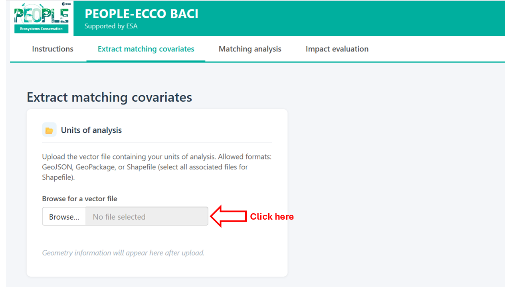
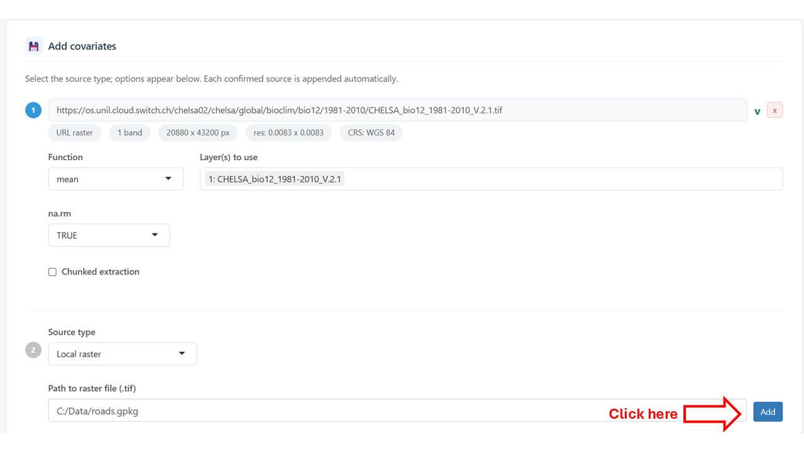

# Getting Started with PEOPLE-ECCO BACI

## Overview

PEOPLE-ECCO BACI is an interactive tool for spatial impact evaluation using
the Before-After Control-Impact (BACI) design. It is intended for assessments
of conservation or policy interventions where treated units (e.g. protected
areas, project sites) can be compared to similar untreated control units over
time.

The workflow is organised into three sequential tabs:

1. **Extract matching covariates** — enrich your vector dataset with
   covariate layers from local or remote sources
2. **Matching analysis** — match treated units to comparable controls based
   on the extracted covariates
3. **Impact evaluation** — estimate the BACI contrast and its significance
   for each matched impact unit

Each tab produces an output file (GeoPackage) that can be saved and reused
as input for subsequent steps, so the workflow can be paused, resumed, or started at the desired step, 
or combined with custom analysis in other software environments.

---

## Before you start

You will need:

- A **vector file** of units of analysis (polygons or points) in any format
  supported by GDAL: `.gpkg`, `.geojson`, `.shp`. Each feature represents
  one unit (e.g. a restoration site, a grid cell, am in situ dite, an administrative unit).
- A **binary treatment attribute** identifying which units received the
  intervention (1 = treated / impact, 0 = control).
- One or more **covariate layers** to use for matching - as attribute to the input vector file, or as local raster files,
  local vector files, or remote raster accessible via url.
- One or more **impact variable layers** -as attributes to the input vector or from an additional source- representing the outcome of interest,
  either as a single effect variable or as a before and after variable.

---

## Tab 1 — Extract matching covariates

This tab prepares the matching dataset by extracting covariate values for
each unit of analysis.

### Input vector

Upload your vector file of units of analysis. The app accepts `.gpkg`,
`.geojson`, and `.shp` (with all associated sidecar files). Once loaded,
a summary of the geometry type, number of features, and available attributes
is shown.

Loading the vector file will display a plot on the right, where you can select the vector attribute to visualize.

You can choose which existing attributes to retain in the output alongside
the newly extracted covariates.

### Additional covariate sources

One or more covariate sources can be added using the **Add** button.
For each source, select the source type:

- **Local raster** — a raster file on your computer (GeoTIFF or similar).
  Select which layers to use and the spatial summary function (mean, median,
  min, max, sum, sd). For polygon units, extraction uses coverage-weighted
  aggregation, or nearest neighbour or bilinear interpolation extraction from the polygon's centroid if "simple" or "bilinear" is selected
  For point units, values are sampled at the point location. 
- **URL raster** — a raster accessible via a web URL (e.g. a COG file).
  Same extraction options as a local raster.
- **Local vector** — a vector file on your computer. Select the summary
  function: mean, median, sd, min, max, sum (for point covariates within
  polygons), count (points within polygons only), minDistance (minimum
  distance from each unit to the nearest feature), or merge (join attributes
  by geometry or by a shared ID field).
- **openEO collection** — a remote dataset accessible via the Copernicus
  Data Space Ecosystem (CDSE) openEO API. This section is experimental and is currently 
  only implemented for the **Copernicus DEM 30m** collection. Terrain parameters
  (elevation, slope, aspect, northness, eastness) can be extracted directly.
  Authentication via OAuth2 is required. 

After pressing the **Add** button, metadata of the data source will be presented,
and the possibility to provide an additional data source is displayed.

### Running extraction

Provide a filename for the output GeoPackage file and 
click **Extract covariates** to run. Progress is shown in a notification bar.
Any errors per source are reported without stopping the extraction of other
sources. 

---

## Tab 2 — Matching analysis

In this tab inputs are provided to match impact unit to one or more control units based
on specified covariates, using the `MatchIt` package.

### Input dataset

Load the covariate-enriched vector from Tab 1 (automatically carried over if
running sequentially) or upload an existing file. A map of the loaded units
is shown, and attribute to visualize can be selected.

### Select ID and treatment attribute

When the input dataset is loaded, select the attributes corresponding to the treatment and,
optionally, the unique ID of the features. 

### Covariate selection

Select which attributes to use as matching covariates. A multicollinearity
check (correlation matrix and Variance Inflation Factor table) is available
to help identify redundant variables before matching.

### Matching parameters

Configure the matching method and options - see the information of the
[MatchIt](https://cran.r-project.org/package=MatchIt) package for more details:

- **Method** — nearest neighbour, optimal, genetic, full, exact, CEM,
  cardinality, or subclassification.
- **Estimand** — ATT (average treatment effect on the treated), ATC, or ATE.
- **Distance** — propensity score method (logistic regression, probit, etc.)
  or distance metric (Mahalanobis, Euclidean).
- **Replace** — whether control units can be reused across matches.
- **Ratio** — number of controls matched to each impact unit (1:k).
- **Caliper** — optionally constrain matches by distance. An overall distance
  caliper and per-variable calipers can be set independently, each with a
  choice of standard deviation or raw units.

### Evaluation

After running matching, the evaluation section shows:

- An interactive map of matched pairs, coloured by treatment status.
- Covariate balance statistics (standardised mean differences before and
  after matching).
- Cobalt diagnostics (love plot and density overlap plots per covariate).

Enter an output filename and click **Save .gpkg** to write the matched dataset 
as a GeoPackage for further analysis.

---

## Tab 3 — Impact evaluation

This tab estimates the treatment effect for each matched impact unit using
the BACI design.

### Input dataset

Load the matched pairs vector from Tab 2 (automatically carried over if
running sequentially) or upload an existing file. Select the treatment
attribute, treatment value, unique ID, and match ID columns. These are
pre-filled automatically if coming from Tab 2.

### Select study design

Currently, **BACI contrast and p-value** is the only implemented impact assessment method.
For this method, one of two study designs must be chosen: **Before-After-Control-Impact** 
or **Control-Impact**. In the former, the before and after attributes are first combined into a
effect attributes. The latter starts directly from the effect attributes.

### Impact variable sources

Add one or more sources for the impact variable (the outcome of interest), as **effect** or
for both the **before** and **after** periods. Source types are the same as
in Tab 1 (local raster, URL raster, local vector).

Alternatively, if the before and after values are already attributes in the
matched vector (e.g. extracted in Tab 1), select **From vector of matches**.

### Spatial unit of BACI computation

Impact assessment can be either run for the individual treatment units,
or for the pool of treatment units combined. 

The BACI contrast for individual units of analysis is computed as:

> **contrast = mean(effect of control units) - effect of impact unit**

and for pooled units of analysis as: 

> **contrast = mean(effect of control units) - mean(effect of impact units)**

where effect = after - before for each unit. A paired t-test is used to
assess significance for the pooled case or for the individual case when the matching ratio is 1:k (k > 1). 
For 1:1 matching at individual unit of analysis, no p-value is computed.

Click **Run impact assessment** to run. Errors per source are reported
without aborting the analysis.

### Results

Results are shown on an interactive map. Use the variable selector to switch
between effect variables when multiple impact variables were extracted. The
**Grey out non-significant units** checkbox dims units where p > 0.05, 
making spatial patterns of significant effects easier to identify.

Click any unit on the map to see a table of contrast values and p-values per
variable for that unit.

Save the results as a GeoPackage using the save card below the map. The
output contains all original matched attributes plus the before/after values,
effect (difference), BACI contrast, and p-value for each impact variable.

For the pooled analysis, a single BACI contrast and p-value are provided per impact variable.

---

## Tips and known limitations

- **Large vector files and openEO**: the CDSE synchronous API has a payload
  size limit. If extraction fails with a server error, check that your input
  vector is in WGS84 (EPSG:4326) before uploading — projected vectors are
  reprojected automatically, but malformed CRS metadata can cause issues.
- **GeoPackage preferred over GeoJSON**: the GeoJSON format mandates WGS84
  coordinates, which can cause projected datasets to be mislabelled on
  read-back. Use `.gpkg` for all local storage.
- **1:1 matching and p-values**: with a single control per impact unit,
  there is no variance to estimate and p-values are not computed. Use a
  ratio of at least 1:3 to obtain p-values.
- **NaN p-values**: if the impact variable has identical values for all
  control and impact units within a matched group (e.g. all zeros), the
  t-test is undefined and the p-value is reported as NA.