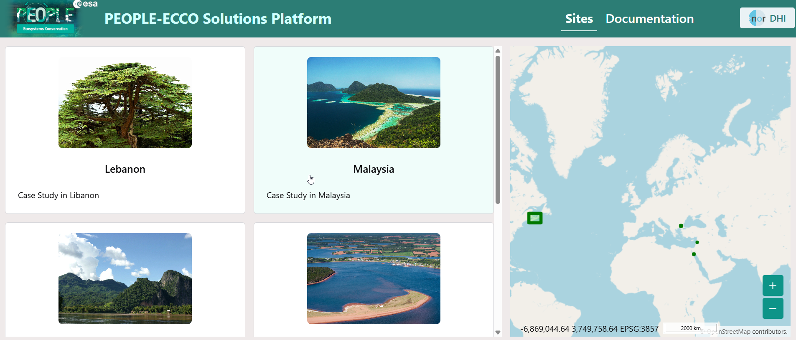
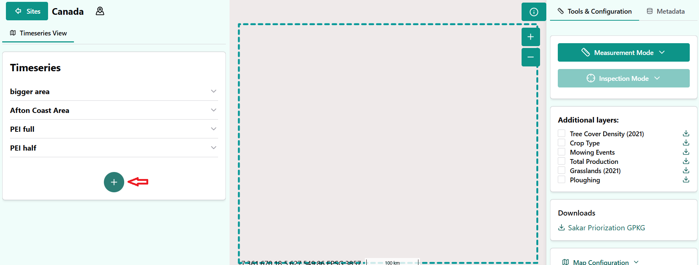
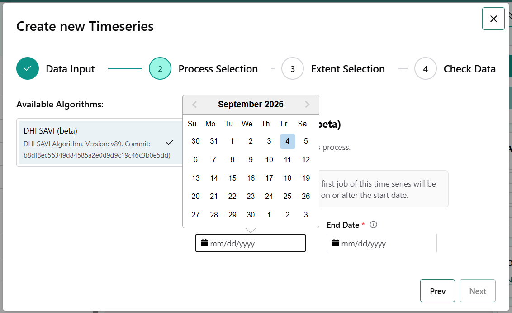
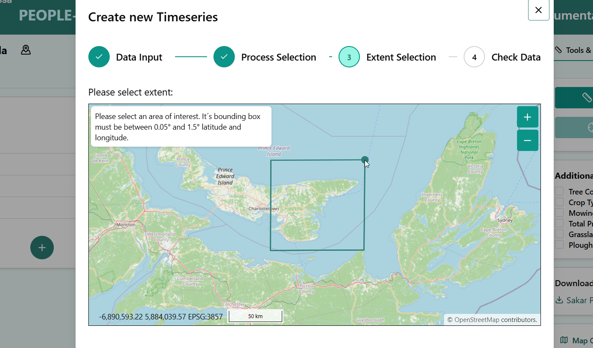
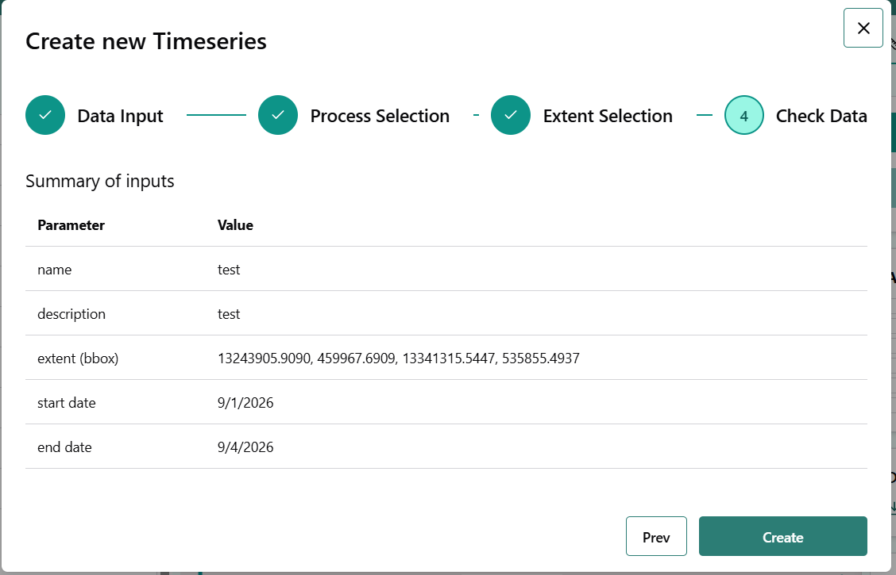

# Getting Started with Habitat Extent 

This page provides a practical quick start for running the Habitat Extent product and understanding what it produces. 

## What the Habitat Extent product does 

The Habitat Extent product generates maps of aquatic habitat types, submerged aquatic vegetation (SAV) and coral reefs, for a defined area and time period. A general description of the workflow is given below, with more detailed explanations on each step listed in the following sections: 

- All available Sentinel-2 Level-2A surface reflectance imagery below a user-defined scene cloud cover percentage are downloaded from [Openeo](!https://openeo.org/), based on the time period chosen. 

- Cloud and pixel quality filters are applied using several bands and meta-data of each image.  

- Several transformations are applied to each image, creating the necessary features used by a Random Forest classifier.

- The model is used to predict habitat classes on each downloaded image, and return the different class probabilities on a pixel basis for each image of the time-series. 

- The main result over the time period is created by computing the average probability for each class over all the predicted images. This step is necessary to create a stable and reliable result, to lower the impact of metereological conditions.

The main outputs are: 

- Habitat type maps (e.g. SAV, coral reef).

- Probability maps for different habitat types.

- Binary maps indicating the presence of SAV or coral.

- Vector files delimiting the area for all detected habitat patches.

## Creation of a new habitat extent run

### Step 1 Area selection

### Step 2 Create a new time-series

Click on the `+` symbol at the bottom of the existing time-series. You might need to scroll down to see it.

### Step 3 Select A time range

### Step 4 Select an Area Of Interest (AOI)

### Step 5 Start the run!

## Key runtime parameters 

### Necessary inputs: 

- `Model`

Two different models have been trained, corresponding to two different ecological regions. The first step is to select the appropriate model, while keeping in mind their limitations:

    - A first model, trained in Malaysian coastal waters, is valid all year long, and detects corals as well as subaquatic vegetation.

    - A second model trained on the coastlines of Prince Edward Island, in Canada, which has only been trained on summer imagery (running from June to September), and only detects subaquatic vegetation.

In the portal, the model is selected when choosing the region of interest.

- `Spatial extent`
    - Area of interest, drawn as a polygon on the platform. Areas larger than a sentinel 2 tile (roughly 10.000 square km) might cause data download issues. When using the python code, it is defined as a four coordinates (West, SOuth, East, North), in latitude and longitude values.

- `Time period`
    - Defines the time window for scene selection. The selection of the time frame is critical, and it is recommended to preview the Sentinel 2 imagery on a platform such as [the Copernicus Browser](!https://browser.dataspace.copernicus.eu/) to inspect the available scenes. The algorithm requires as much as possible clear atmospheric and water conditions to perform well, as mist, turbid or turbulent water, sun glint, and cloud shadows all make the classification more difficult.

### Optional parameters
The following parameters are optional and have default values, but might be important to change for different areas of interest.

- `Maximum cloud cover percentage`
    - Selects cloud-free or low-cloud Sentinel-2 observations. Only Sentinel 2 images with a lower cloud coverage are downloaded. By default, this percenatge is set to 40%.

- `SWIR band threshold`

    - Threshold applied on the SWIR band (B11). Only pixels with values below this threshold are kept for the model to predict. This operation removes land, cloud-contaminated pixels, sun glint, turbid water and sensor artifacts. The lower this threshold, the harsher conditions are on the pixel quality. By default, its value is set to 250. 

- `SAV probability threshold`

    - The model's main output are class probabilities, for water, corals and SAV. Only pixels with predicted SAV probability higher than this threshold are considered to contain SAV. This threshold allows increased control on the predicted SAV patches, by allowing a more conservative prediction by increasing this threshold, or by detecting more potential SAV patches by lowering it. The probabilities are multiplied by 10.000 and range between 0 and 10.000. The default trheshold is set at 5000. 

### Parameter reference 

This section summarises the suggested configurable parameters available to users when running the Habitat Extent product.

| Parameter | Used for | Notes |
| --- | --- | --- |
| `Bioregion model` | Classification model | Two available models, one trained in Malaysia, and the other in Canada. |
| `Spatial extent` | Defines the area of interest | Required input as a polygon drawn in the GUI or as polygon bounds in latitude and longitude. |
| `Time period` | Defines the temporal scope | Year or seasonnal window. |
| `Maximum cloud cover` | Maximum cloud cover percentage on queried Sentinel 2 images | Ranges from 0 (no cloud at all) to 100 (completely covered). It is by defult set at 40. |
| `SWIR threshold` | Threshold to apply on the SWIR band | Recommended range from 250 to 1000. |
| `SAV probability threshold` | Probability threshold for SAV to be detected, multiplied by 10.000 | Defaults at 5000. Recommended range from 4000 to 6500. |

## Model outputs

### Aggregated results

Aggregated results are obtained by averaging model prediction on each scene in the selected time-series, and are the main result of the model. This approach is more robust to the noise introduced by metereological conditions.

- The 3-bands probability map, saved as a Geotiff file, containing the Coral, SAV and water class probabilities in this order. It highlights in red high coral probabilities, in green, high SAV probabilities, and in blue high open water probabilities. Pixels appearing in dark show areas where the model certainties are lower.

- A model classification (obtained by selecting the class with maximum probability) map, in GeoTiff format.

- Probability maps for both SAV and coral, saved as GeoTiffs as well.

- Binary mask maps for detected SAV and coral, based on the SAV threshold.

- Vector file outlining all detected patches.

- A Sentinel 2 composite image, which is a good reference ot look at when interpreting the results.

### Per scene results

- RGB probability prediction on every scene, which allows to have more insight on each scene's predictions, and potentially remove them from the set if they cause missclassifications.

- Individual Sentinel 2 images, which can help understand the model predictions on individual images.

## Suggested first run 

- Start with a single AOI, the relevant model and limited time period.

- Preview available Sentinel 2 imagery on [Openeo](!https://openeo.org/), and select a time period with clear water and atmospheric conditions. It is also possible on this viewer to change the cloud cover percentage to preview which scenes would be available at different values.

- If there is a single clear image, you can select a very short time window including only this scene. This type of scene generally yields good prediction results, and is fast to run.

- Inspect outputs for:  

    - Misclassification in turbid or deep water, both for the entire time series, and on per-scene basis.

    - Edge artefacts along coastlines and clouds.

- Adjust the model parameters if needed.
