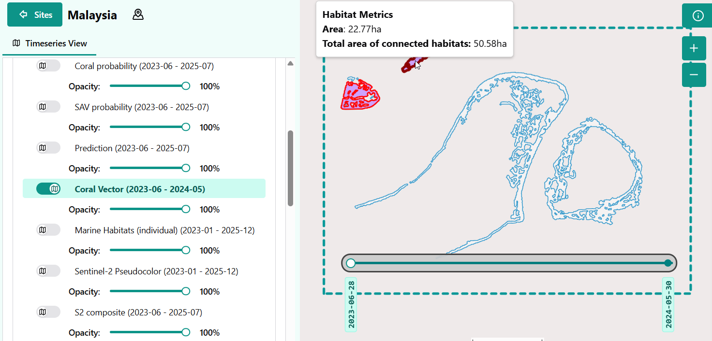

# Getting Started with Habitat Connectivity

This page provides a practical quick start for running the Habitat Connectivity product and understanding how spatial habitat structure and connectivity are derived from classified habitat maps.

## What the Habitat Connectivity product does

The Habitat Connectivity product analyzes the spatial structure and arrangement of habitats to quantify how habitat patches are distributed and connected across the landscape.

The product:

- Uses classified habitat maps from the Habitat Extent product
- Identifies discrete habitat patches
- Computes spatial metrics describing patch size and connectivity between habitat areas

Main outputs include patch size and distribution maps. These outputs help distinguish large continuous habitats, fragmented or isolated patches, and areas with high or low structural connectivity.

## Creation of a new connectivity run

The connectivity product is automatically created for each Timeseries created in the habitat extent product. The process to start a new Timeseries is explained in the habitat extent's[getting started page](../SAV/getting-started.md).

## Additional runtime parameters

### Patch definition parameters

- `minimum_patch_size`: Minimum patch size included in the analysis, defined as the number of pixels per patch. The current default is 1,000 pixels. Smaller patches are excluded to reduce noise and insignificant fragments.
- `connectivity_distance_threshold`: Maximum distance at which two patches are considered connected. The current default is 1,000 m. Connectivity is distance-based rather than based on 4- or 8-neighbour pixel adjacency. This parameter should be user-defined in future versions.

### Connectivity analysis parameters

- `connectivity_metric`: Defines how connectivity between habitat patches is assessed. The current implementation focuses on patch-level relationships determined using the distance threshold.

## What gets written

Each run produces vector layers showing the outline of detected habitat patches. When clicking on the patches in the portal, information about its size and its neighbors are displayed. All the neighboring patches get highlighted as well, as shown in the figure below.

