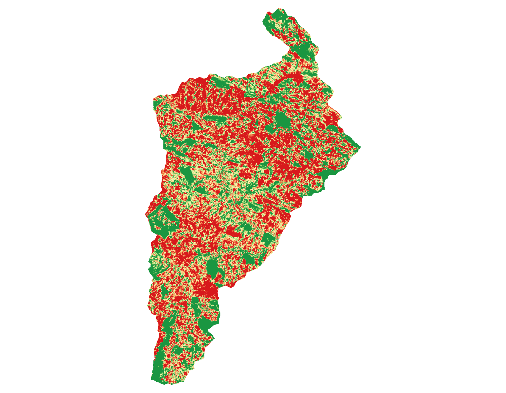
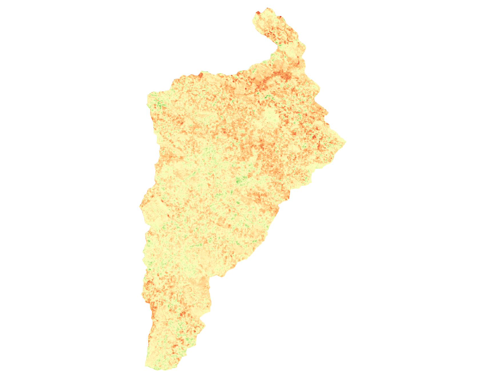
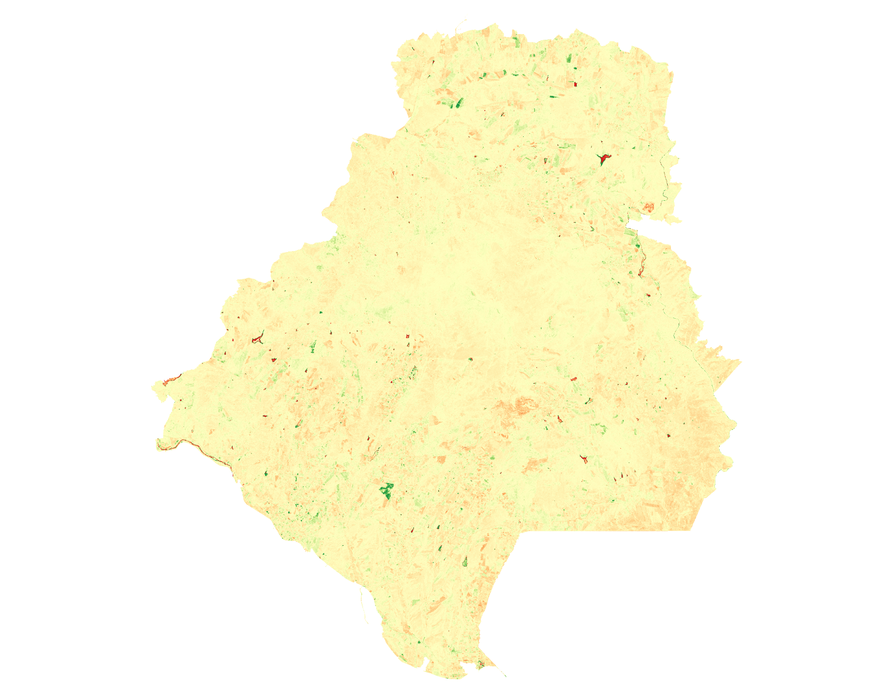

# Key Considerations for Non-Expert Users

This page will explain four key considerations necessary to run the Vegetation Productivity Trend (VPT) solutions:

1. Which target method to use.
2. Which spectral index to use.
3. Which VPT algorithm to use.
4. How to interpret the outputs.

You do not need to be a remote sensing specialist to make these decisions. A practical approach is to start with clear monitoring goals, choose simple settings first, and refine only if needed.

## 1. Choosing a Recovery Target

Your target is the condition you compare your site against.

### Option A: Historical condition target

Use this when:

- Your project goal is for the ecosystem to recover to historical site conditions.
- You have continuous satellite imagery available from the current year back to the pre-disturbance conditions and know th eyear of the disturbance event.
- It is difficult to identify a suitable reference area nearby.

Benefits:

- Easy to explain.
- Site-specific historical baseline.

Limitations:

- Historical pre-disturbance conditions may no longer be realistic under current climate and land-use pressures.

### Option B: Reference site target

Use this when:

- Your project goal is for the ecosystem to recover to conditions represented by a reference site.
- You have continuous satellite imagery available from the current year back to a determined baseline from which to assess recovery.
- You have nearby areas that represent the desirable condition.

Benefits:

- A reference site is simpler to work with in dynamic landscapes where multiple disturbances may occur.
- Aligned with restoration planning processes that often use reference sites.

Limitations:

- Challenge to select an appropriate, representative reference site.

### Quick decision rule

- If your project goal is for "the ecosystem to recover to historical site conditions" and you konw the year of disturbance or start of the restoration effort, start with a historical target (if there is imagery that goes back to a pre-disturbance date).
- If your project goal is for "the ecosystem to recover to conditions represented by a reference site" start with a reference target. You may not know the year of disturbance or start of the restoration effort but choose a baseline year.
- If unsure, test both and compare whether conclusions are consistent.

## 2. Choosing a Spectral Index

Different indices respond to different vegetation properties. Choose the one that best matches your ecological question.

### Common starting choices

- **Normalized Difference Vegetation Index (NDVI)**: most popualr vegetation index responding to vegetation greenness.
- **Normalized Burn Ratio (NBR)**: popular vegetation index used for fire disturbance and recovery but is generally applicable beyond fire applications and helpful for woody vegetation recovery.
- **Soil Adjusted Vegetation Index (SAVI)**: a popular vegetation index that introduces a correction factor for background soil. Useful in areas with sparse vegetation or exposed soil, because it reduces soil-backgroun effects.

### Quick comparison table

| Index | Best used when | Main strength | Watch out for |
| --- | --- | --- | --- |
| NDVI | You want a simple first look at vegetation greenness | Easy to interpret and widely used | Can saturate in dense vegetation and be influenced by soil/background effects |
| NBR | Disturbance and recovery (especially woody vegetation) are central to your question | Strong disturbance/recovery signal in many landscapes | Interpretation can vary by ecosystem type and disturbance context |
| SAVI | Vegetation is sparse and bare soil is visible | Reduces soil-background influence compared with NDVI | Less intuitive for some users than NDVI and still depends on data quality |

### Quick index decision rule

- Choose **NDVI** for a simple first look at overall greenness.
- Choose **NBR** when woody vegetation regrowth is central to your question.
- Choose **SAVI** where bare soil is common and may bias greenness indices.
- If possible, run at least two indices and check whether they tell a consistent story.

## 3. Choosing the Algorithm

Two VPT algorithms use regression to fit a trend line through the time series of spectral index values on a pixel basis. The key difference is the time interval of the input images.

- **Spectral recovery VPT algorithm** uses annual composites and Thiel Sen regression to establish the trend in the vegetatio index from the baseline year to present.
- **Seasonal Sen's slope VPT algorithm** uses monthly time series with Seasonal Sen's slope to make a pair-wise comparison between values from the same month as the basis for deriving a trend line for the spectral index.

### When to prefer each

- Prefer **spectral recovery (annual)** when:
	- The vegetation is not highly seasonal.
	- You have annual composites, or cloud cover would make it challenging to compute monthly composites.

- Prefer **seasonal Sen's slope (monthly)** when:
	- The vegetation is highly seasonal (e.g., grassland / savanna or dry deciduous forest).
	- You have monthly composites and cloud cover does not prevent creating good monthly composites. Note, you do not need a composite each month, but do require a consisten interval. For example, in snow-affected regions you could use monthly composites from the snow-free months (e.g., April to October).

### Recommended practice

If data availability allows, run both. Matching results increase confidence. Differences can highlight where seasonal effects or data quality deserve closer review.

## 4. Interpreting the Outputs

Spectral recovery and Seasonal Sen can write the same metrics. The layers you receive depend on what you request, not on which mode you ran. The usual layers are R80P, DeltaIR, and percent change. Slope and intercept, the raw fitted trend line, can be extracted as well.

The maps below are examples of how to read those layers. Vietnam shows R80P and DeltaIR from a spectral-recovery run. Sakar, Bulgaria shows percent change from a Seasonal Sen run. Either metric could have been requested from the other mode.

In these examples, green marks higher or increasing productivity and red marks lower or declining productivity. Yellow sits near the middle of the scale.

### Percent recovered to threshold (R80P)

Shows whether a pixel is close to reaching 80% of its recovery target. A value of 1 means the pixel has reached 80% of that target.

- R80P higher than 1 means the pixel has surpassed the target.
- R80P lower than 1 means more recovery is still needed.

_R80P for a Vietnam spectral-recovery run. Dark green pixels are at or above the 80% recovery target. Red pixels are far below it. Yellow is in between. Large red areas do not by themselves mean the site is worsening; check DeltaIR or percent change for the direction of change._

### Direction and absolute change of vegetation productivity (DeltaIR)

Shows magnitude and direction (positive or negative) in vegetation productivity over the monitoring period relative to the starting year.

- Positive DeltaIR indicates improvement.
- Near-zero DeltaIR means little net change.
- Negative DeltaIR indicates productivity decline.

_DeltaIR for the same Vietnam run. Green is an increase in the spectral index, yellow is little net change, and orange to red is a decline. Much of this site is yellow to light orange, with scattered green patches of increase._

Despite the Vietnam BAP composites behind these maps still containing some cloud-related artifacts, the metrics are still usable. Where cloud cover is extremely high throughout the year, expect residual haze or gaps in the composites and read sharp. If artifacts or residual clouds are more severe than those examples or if you see patterns in the ouptuts that don't match your understanding of the site try obtaining better composites before re-running the tool. See the [BAP key considerations](../best-available-pixel/key-considerations.md#spectral-recovery-mode-yearly-reflectance-composites-vietnam) for examples of the composites mentioned here.

### Percent change

Percent change expresses the same trend as a relative change over the monitoring period.

- Positive percent change indicates an increase in the spectral index.
- Near-zero percent change means little net change.
- Negative percent change indicates a decline.

_Percent change from a Seasonal Sen run for Sakar, Bulgaria. Pale yellow is little net change. Green patches are increases and orange to red patches are decreases. Most of the landscape is relatively stable, with change concentrated in small areas._

### Slope and intercept

Slope is the fitted rate of change in the spectral index, and intercept is the fitted starting level of that line. Request these when you need the regression parameters themselves, for example to compare rates between sites. The summarized maps above are usually enough for a first look at where productivity increased, stayed stable, or declined.

### Interpreting the metrics together

Below are some examples of how one might interpret the outputs from the VPT solution together:

- **High R80P + positive DeltaIR or percent change**: an increase in vegetation productivity has brought the location to or near the target condition.
- **High R80P + near-zero DeltaIR or percent change**: vegetation productivity has stayed stable at or near the target condition.
- **Low R80P + positive DeltaIR or percent change**: vegetation productivity is below the target condition but improving.
- **Low R80P + negative DeltaIR or percent change**: vegetation productivity has declined and is below the target condition.

## 5. A Simple Decision Workflow

1. Define your restoration question in plain language.
2. Choose a recovery target that matches that question.
3. Start with one index (NDVI, NBR, SAVI), then add another if needed.
4. Choose algorithm based on seasonality of vegetation productivity and available data (annual vs monthly).
5. Interpret the ouptut productivity trend metrics individually and in combination. Investigate areas of interest.
6. Use the productivity trend metrics in relation to other datasets (e.g., field data, expected reforestation intervention outcomes).

## 6. Common Pitfalls to Avoid

- Ensure you understand that spectral index change is only and indicator of ecosystem change, and one factor to consider when assessing a conservation intervention.
- Using a reference site that is not representative of the area monitored.
- Poor quality input image series, caused by clouds, or a time series that is too short to capture vegetation productivity change.
