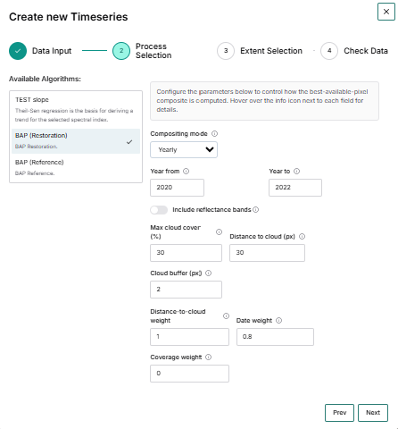

# Create a New Timeseries

Use the workflow below to create a new timeseries in the PEOPLE-ECCO Solutions Platform.

This timeseries creation can be used as an input for both:

- Vegetation Productivity Trend (VPT)
- Vegetation Disturbance Occurrence (VDO)

> Important:
> The first examples in this handbook are based on demonstration sites where the process parameters are already configured.
> For those sites, you only need to select the process and date range.
> For other demonstration sites, such as **Garamba** or **Bulgaria**, you can configure the BAP parameters manually in **Process Selection** (see Step 3B).

## Step 1. Start from the Timeseries panel

In the left-side **Timeseries** panel, click the **+** button to open the **Create new Timeseries** wizard.

## Step 2. Fill Data Input

In the **Data Input** step:

1. Enter a **Name** for the timeseries.
2. Optionally add a **Description**.
3. Click **Next**.

The wizard shows four steps across the top: Data Input, Process Selection, Extent Selection, and Check Data.

## Step 3A. Choose process and date range (preset-parameter sites)

In **Process Selection**:

1. Select the process from the **Available Algorithms** list (shown: **Spectral Recovery**).
2. Set the **Start Date** and **End Date**.
3. Click **Next**.

On preset-parameter sites, the parameter panel can show a message indicating that there are no configurable parameters for the selected process.

## Step 3B. Select BAP parameters (Garamba, Bulgaria, and similar sites)

For sites where parameter controls are available in **Process Selection**:

1. Select a BAP process (for example, **BAP (Restoration)**).
2. Set the date range using **Year from** and **Year to**.
3. Configure the available BAP parameters, as needed:
	- **Compositing mode**
	- **Include reflectance bands**
	- **Max cloud cover (%)**
	- **Distance to cloud (px)**
	- **Cloud buffer (px)**
	- **Distance-to-cloud weight**
	- **Date weight**
	- **Coverage weight**

After setting the parameters, continue to **Extent Selection**.

## Step 4. Select the extent

In **Extent Selection**:

1. Define or adjust the analysis extent on the map.
2. Confirm the bbox values shown in the extent info panel.
3. Click **Next**.

## Step 5. Review and create

In **Check Data**:

1. Review the summary (name, description, extent, start date, end date, and selected parameters when applicable).
2. If everything is correct, click **Create**.

After creation, the new timeseries appears in the left panel with its metric layers and opacity controls.

