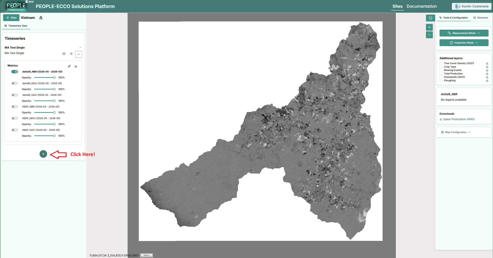
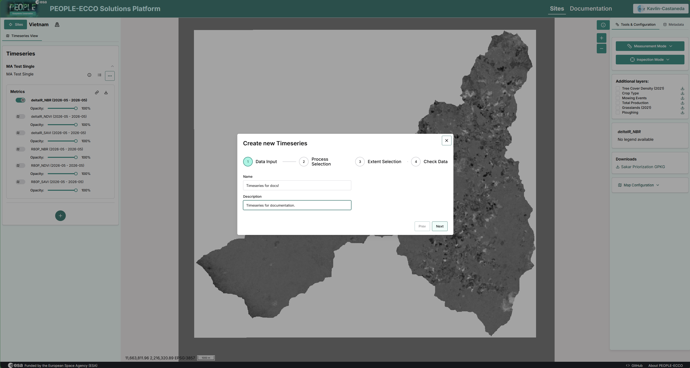
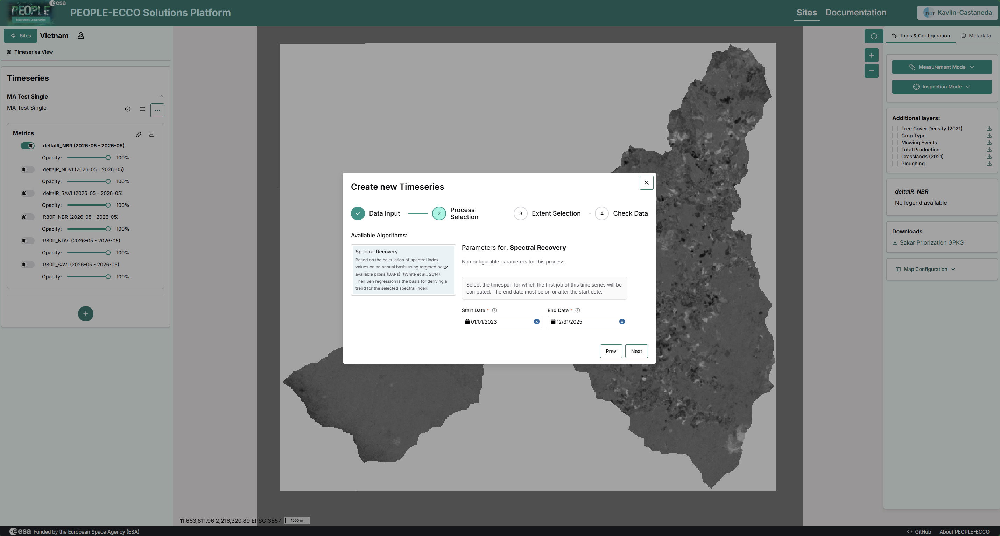
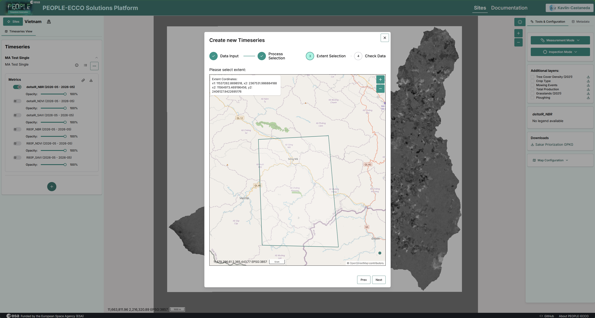
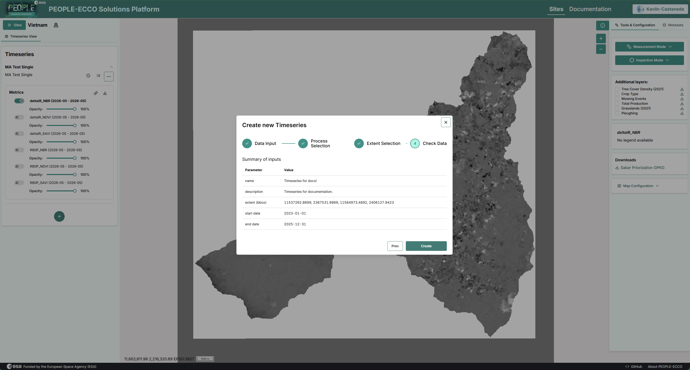

# Create a New Timeseries

Use the workflow below to create a new timeseries in the PEOPLE-ECCO Solutions Platform.

This timeseries creation step can be used as an input for both:

- Vegetation Productivity Trend (VPT)
- Vegetation Disturbance Occurrence (VDO)

## Step 1. Start from the Timeseries panel

In the left-side **Timeseries** panel, click the **+** button to open the **Create new Timeseries** wizard.

## Step 2. Fill Data Input

In the **Data Input** step:

1. Enter a **Name** for the timeseries.
2. Optionally add a **Description**.
3. Click **Next**.

The wizard shows four steps across the top: Data Input, Process Selection, Extent Selection, and Check Data.

## Step 3. Choose process and date range

In **Process Selection**:

1. Select the process from the **Available Algorithms** list (shown: **Spectral Recovery**).
2. Set the **Start Date** and **End Date**.
3. Click **Next**.

## Step 4. Select the extent

In **Extent Selection**:

1. Define or adjust the analysis extent on the map.
2. Confirm the bbox values shown in the extent info panel.
3. Click **Next**.

## Step 5. Review and create

In **Check Data**:

1. Review the summary (name, description, extent, start date, end date).
2. If everything is correct, click **Create**.

After creation, the new timeseries appears in the left panel with its metric layers and opacity controls.

