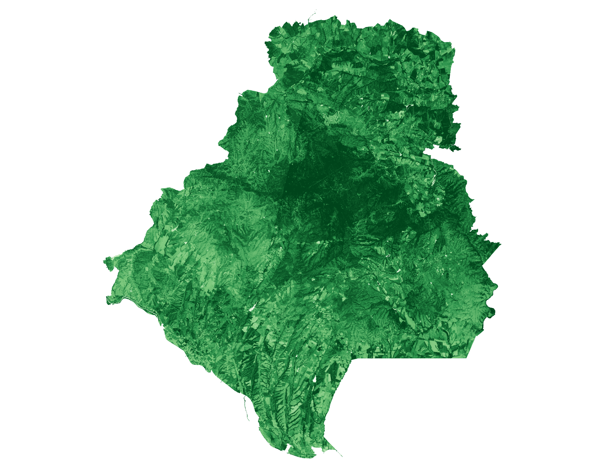
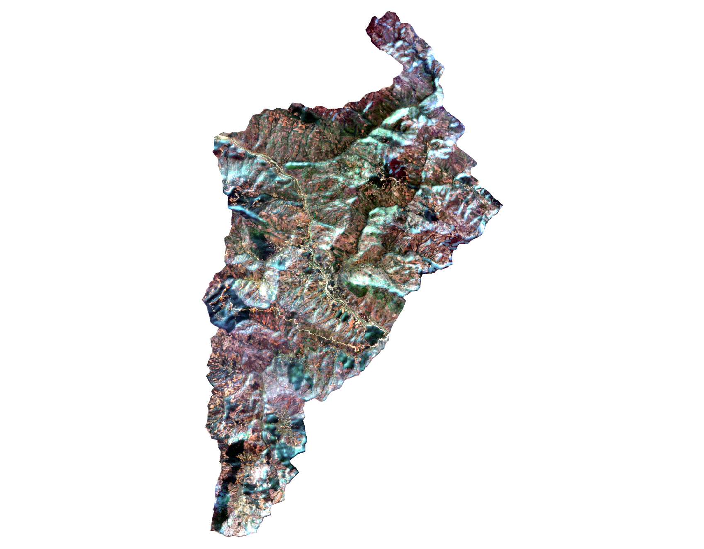
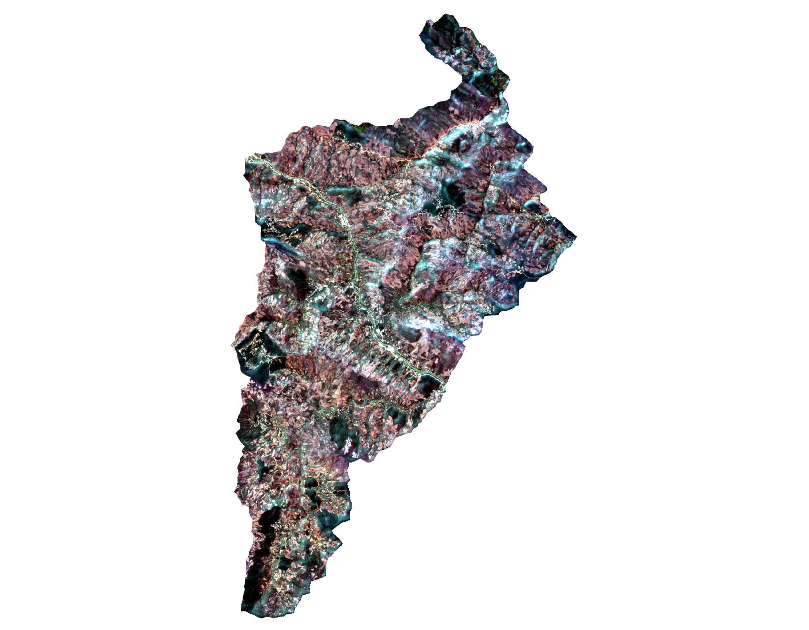

# Key Considerations for Best-Available Pixel

This page provides practical guidance for configuring Best-Available Pixel (BAP) runs and interpreting outputs reliably.

## 1. Start with clear compositing goals

Before setting parameters, define what your composite should optimize:

- Maximum spatial completeness (fewer gaps).
- Minimum cloud and haze contamination.
- Consistent temporal representation across years.

Different goals can require different trade-offs between strict masking and usable coverage.

### Choose the downstream algorithm mode first

Before fixing BAP parameters, decide which downstream algorithm version/mode the composites are for:

- Spectral Recovery mode: yearly composites, typically reflectance-focused outputs.
- Seasonal Sen's slope mode: monthly composites, typically index-focused outputs.

In practice, this is a key design decision because temporal granularity and export payload should match the downstream method you plan to run. Examples of both modes are in [Validate outputs before downstream analysis](#8-validate-outputs-before-downstream-analysis).

## 2. Temporal window design is critical

BAP ranks observations within a defined period. The period you choose strongly shapes results.

Use monthly windows when:

- Phenology is strong data capturing month-to-month change is an important input to your analysis (e.g., PEOPLE-ECCO VPT Seasonal Sen's Slope).

Use yearly windows when:

- Your analysis needs require a single annual measurement.
- Monthly observation density is too frequent, e.g., snow-affected regions where winter months are variable and not comparable.
- Cloud cover is too challenging for monthly composites.

Practical tip:

- In strongly seasonal or snow-affected regions, exclude months that are not ecologically comparable.

## 3. Cloud controls: strictness vs coverage

Three settings control this balance:

- max_cloud_cover: scene-level prefilter.
- exclude_scl_classes: pixel-level exclusions from SCL classes.
- cloud_buffer_px: extra safety margin around cloud/shadow pixels.

If masks are too strict:

- Output can become spatially sparse.

If masks are too permissive:

- Residual cloud contamination can remain.

Recommended approach:

1. Start with default exclusions and a modest cloud buffer.
2. Inspect a few representative tiles and months.
3. Adjust one parameter at a time.

## 4. Distance-to-cloud behavior matters

The distance-to-cloud term is one of the strongest ranking signals. The dtc_max_distance setting controls how quickly score improves as distance from clouds increases.

- Larger values are more conservative near clouds.
- Smaller values can increase usable pixels but may allow more edge artifacts.

Tune this according to local cloud dynamics and required product cleanliness.

## 5. Understand the default score weighting

The implementation combines:

- distance-to-cloud,
- date proximity,
- cloud-free area coverage,

with default relative weights of 1.0, 0.8, and 0.5.

These weights are configurable through `score_weight_dtc`, `score_weight_date`, and `score_weight_coverage`; the values above are defaults, not fixed constants.

Implication:

- Cloud proximity and date proximity are prioritized over scene level cloud coverage.

If your use case prioritizes completeness over strict quality, adjust the weights and document the final choice for reproducibility.

## 6. AOI geometry quality is non-negotiable

BAP is sensitive to geometry validity because masking and clipping happen at pixel level.

Check before running:

- Null or empty geometries.
- Invalid polygons.
- CRS mismatches.

Poor geometry quality can look like data-quality problems even when the ranking logic is correct.

## 7. Resolution and runtime trade-offs

Higher spatial resolution and long temporal windows increase processing load and backend queue time.

For robust operations:

- Use resume mode to skip existing outputs.
- Consider tile-first workflows for many study areas in a contiguous location.
- Keep run manifests to support recovery after interruptions.

## 8. Validate outputs before downstream analysis

Do not assume that all composites are equally reliable.

Perform quick checks:

- Visual check for cloud-edge artifacts.
- Coverage consistency across periods.
- Outlier periods with unusually low valid data.

Only after quality checks should outputs be used for index trends, disturbance mapping, or recovery metrics.

### Seasonal Sen mode: monthly index composite (Bulgaria)

Seasonal Sen expects monthly composites, usually exported as a spectral index rather than reflectance. The Sakar region in Bulgaria is an example. The 2025 composite below is a single SAVI index image with continuous coverage across the site, which is one timestep of what the monthly workflow needs before the trend is fit.

_Example BAP composite (Seasonal Sen mode) for the Sakar region, Bulgaria, in June 2025. Darker shades of green indicate higher values in the SAVI spectral index. Coverage is continuous across the site._

### Spectral recovery mode: yearly reflectance composites (Vietnam)

Spectral recovery expects one composite per year, usually exported as reflectance. The Vietnam examples below are yearly composites for 2016 and 2025.

_Example BAP composite (spectral-recovery mode) for a sub-basin in Vietnam in 2016. One can clearly see areas that are have forest cover as compared to areas that have been cleared. Bright cyan and white patches are residual cloud and haze._

_The same Vietnam site in 2025. Cloud-related artifacts are still visible._

!!! note
    These Vietnam composites  contain cloud-related artifacts, however they  can still be used for our analysis. In areas with extremely high cloud cover throughout the year it is often not possible to produce a perfect composite. Spme whispy artifacts such as the ones we see in these images still allow the spectra to be detected by the algorithm. The [VPT key considerations](../VPT/key-considerations.md#4-interpreting-the-outputs) show R80P and DeltaIR maps produced from this kind of input.

## 9. Interpretation caveats

BAP improves input data quality for further analysis but still requires careful evaluation.

- Persistent cloud regimes may still leave artifacts in the composite. That does not automatically make the composite unusable. However these inputs should be used with caution as they can negatively impact results.
- Phenology differences between years can remain if windows are not harmonized.
- Composite quality is not equivalent to ecological validity; field context is still essential.

## 10. Minimum reproducibility checklist

Record these settings for every production run:

- temporal window definition,
- selected years/months,
- max_cloud_cover,
- exclude_scl_classes,
- cloud_buffer_px,
- dtc_max_distance,
- score weights,
- spatial resolution,
- output manifest path.

This makes reruns and cross-site comparisons far more reliable.

## 11. Full parameter summary

For a complete parameter-by-parameter reference, see the parameter section in the getting started page: [Getting Started parameter reference](getting-started.md#7-parameter-reference).
