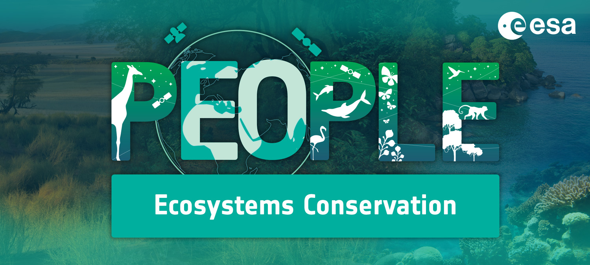

# PEOPLE-ECCO User Handbook

Welcome to the user handbook for **PEOPLE-ECCO** — *Enhancing Ecosystems Conservation through Earth Observation Solutions, Capacity Development and Co-design*. This handbook documents the PEOPLE-ECCO Platform and its Solutions for the civil society organizations, NGOs, and practitioners who use them.

For general project information, news, and background, visit the official project website: [www.people-ecco.eu](https://www.people-ecco.eu/).

## About the project

PEOPLE-ECCO is an ESA-funded initiative that addresses biodiversity loss and climate change mitigation by empowering conservation-focused civil society organizations (CSOs) and NGOs with Earth Observation technology. It pursues two goals:

1. Involve conservation-focused CSOs/NGOs in **co-designing** Earth Observation methods applicable to their work, while building EO capacity.
2. Create and validate EO-integrated methods that serve two purposes: monitoring **existing protected areas** and identifying **areas to be protected**.

The project combines a user-focused track — engagement and co-design with "Early Adopter" organizations — with a technology-focused track that develops and validates the EO Solutions themselves. Large-scale demonstrations span six countries across terrestrial, wetland, and coastal-marine ecosystems, with monitoring zones exceeding 10,000 km² and suitability-assessment zones covering 80,000 km² or entire nations.

## Consortium and Early Adopters

- **Funded by:** European Space Agency (ESA)
- **Consortium:** Faculty ITC (University of Twente), 52°North, DHI, Hatfield Consultants
- **Early Adopters:** African Parks, Bulgarian Society for the Protection of Birds, IUCN Vietnam, Lebanon Reforestation Initiative, Prince Edward Island Watershed Alliance, Reef Check Malaysia

## Content of this handbook

- **[PEOPLE-ECCO Platform](/platform/)** – an overview of the web-based platform used to manage sites, configure timeseries, and run Solutions.
- **[PEOPLE-ECCO Solutions](/solutions/)** – overview of the developed Solutions
- **[Solution Handbook](/handbook/terrestrial-solutions/VPT/theoretical-background/)** – theoretical background, key considerations, and getting-started guides for each individual Solution (e.g. Vegetation Productivity Trend, Best Available Pixel, Submerged Aquatic Vegetation).
- **[Solutions Integration](/integration/integration-interoperability/)** – how to run a Solution locally as an Earth Observation Application Package (EOAP), outside of the Platform.
