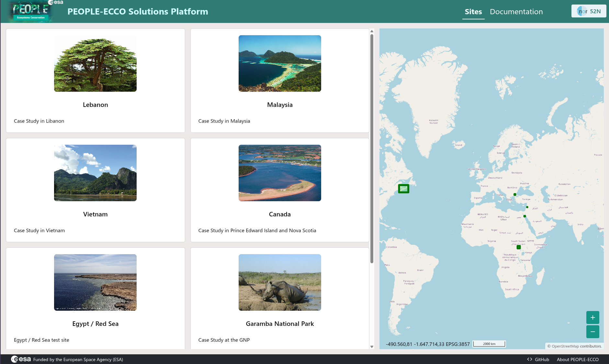
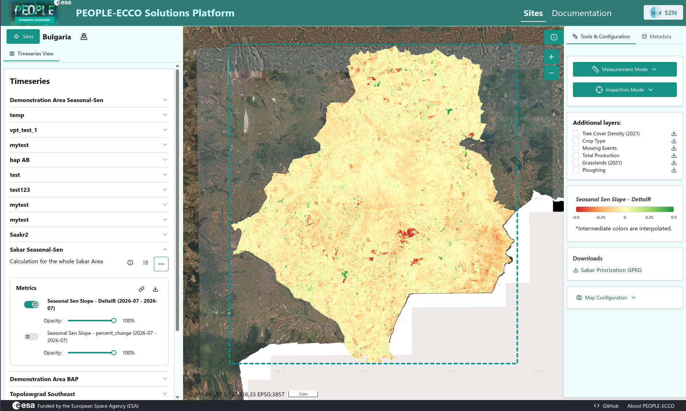
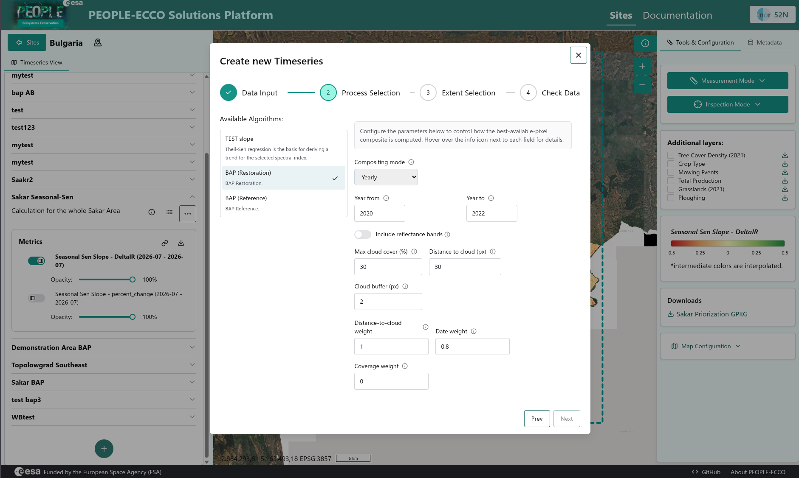

# PEOPLE-ECCO Platform

The PEOPLE-ECCO Platform is a user-centred application that allows users to execute PEOPLE-ECCO Solutions via the web browser. It features as user authentication layer (based on Keycloak) and a set of different components, described below.

**Architecture:**

- **Web UI** – a map-centered web portal (built on Open Pioneer Trails) for visualizing study sites, time series, processing jobs, and spatial results.
- **Backend API** – Python-based, it provides an API that manages scenarios, processes, timeseries, job orchestration, coordinated via Prefect. It also realizes openEO integration (authentication, job management) for Solutions and algorithms.
- **Solutions** – six thematic algorithms covering marine ecosystems (vegetation mapping, habitat connectivity), terrestrial monitoring (productivity trends, disturbance detection), and impact assessment (before-after-control methods).
- **Algorithm Framework** – a standardized execution contract that allows the platform to create reproducible analysis results.

The overall design focuses on modularity and extensibilit (i.e., algorithms) as well as open standards to ensure longevity of Solutions and algorithms.

## Web UI

The Web UI features three main views, which are described below.

### Landing page

The landing page presents the available test sites as a card list alongside a world map marking each site's location. Users can select a site to enter its dedicated view (see below).

### Site analysis results

This view shows the result of Solution execution for a particular site. Here the results for the Seasonal Sen's Slope algorithm, applied to the Sakar region in Bulgaria, are shown. The map overlays a color-coded trend layer (red to green, indicating negative to positive slope in DeltaIR) on satellite imagery of the area, with additional layers (e.g. Tree Cover Density, Crop Type, Grasslands). The table of contents on the left side allows users to select different time series and inspect their results.

The site view also allows users to download all result data for a particular timeseries (as a Zip archive) and create temporary pre-signed links to individual results (e.g. COG or GeoJSON) for direct integration into related applications (e.g. the BACI solution).

### Creation of a new timeseries

Via a dialog users can create a new timeseries in the (spatial) context of a site. Each timeseries references a specific PEOPLE-ECCO Solution/algorithm (here, "Best Available Pixel for Restoration Sites") and is configured through a step-by-step wizard: users set parameters which are specific to the particular PEOPLE-ECCO Solution.
